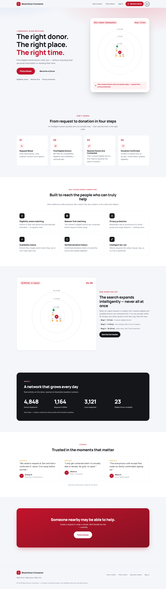
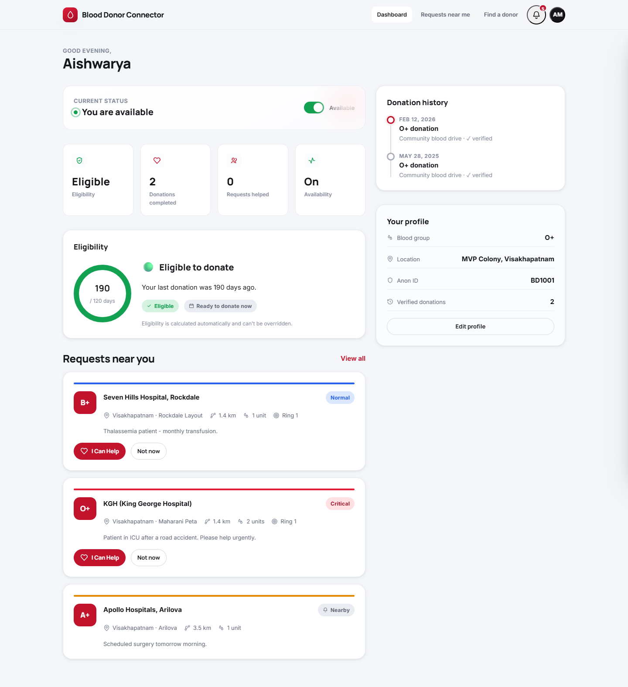
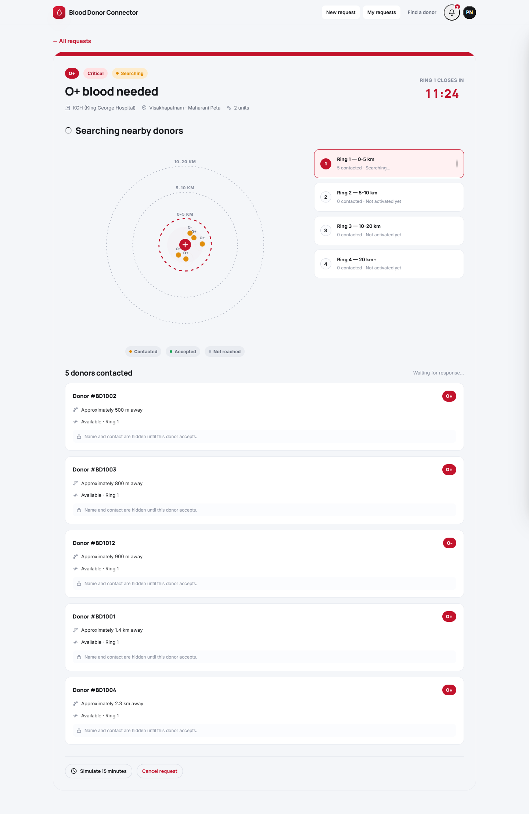
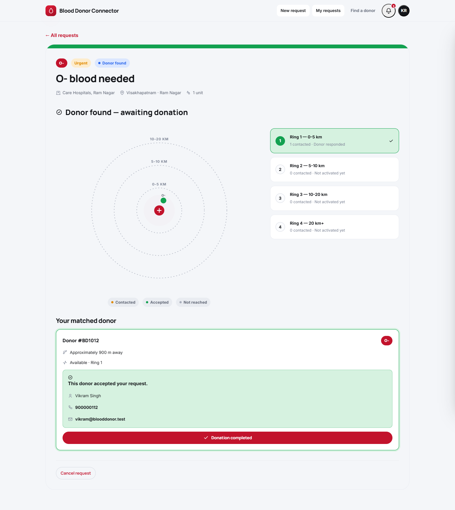
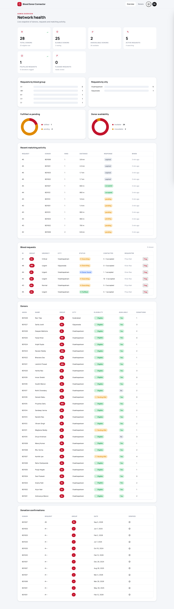
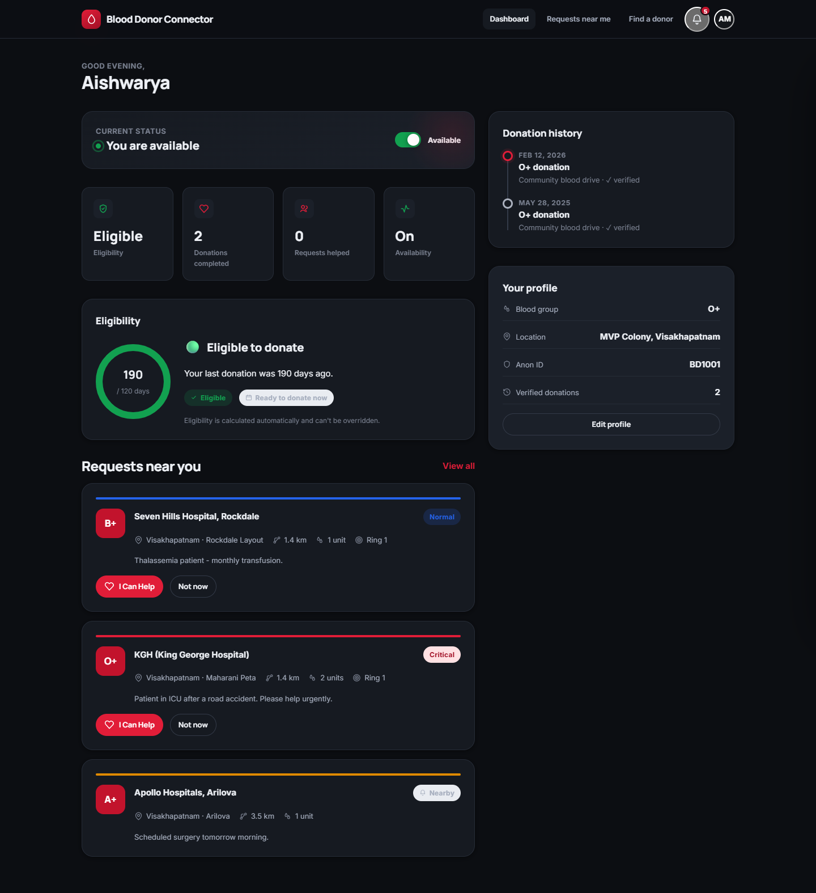

# Blood Donor Connector

### “Right donor. Right place. Right time.”

An **intelligent emergency blood-matching system** — not a directory of donors.
It works out *who can actually help today*, contacts the **nearest eligible
people first**, expands the search **ring by ring**, and keeps everyone's
contact details private **until a donor explicitly accepts**.

> **USP:** *Only contact donors who can donate today — nearest first, privacy protected.*

---

## Screenshots

| Landing | Donor dashboard |
| --- | --- |
|  |  |

| Live ring-matching tracker | Donor found — reveal on accept |
| --- | --- |
|  |  |

| Admin overview | Dark mode |
| --- | --- |
|  |  |

---

## Why it's different

| Typical platform | Blood Donor Connector |
| --- | --- |
| Notifies everyone in a city | Contacts the **5 nearest eligible** donors first |
| Shows donors who recently donated / moved / are unavailable | **Eligibility engine** excludes anyone in their rest period — no override |
| Exposes phone numbers up front | **Anonymous until accept** — `Donor #BD1042`, blood group, rough distance |
| One big blast | **Ring-based fan-out**: 0–5 km → wait 15 min → 5–10 km → 10–20 km |

---

## Tech stack

* **Backend:** Python + Flask, SQLAlchemy ORM, JWT auth, modular
  routes / services / models. SQLite by default, **PostgreSQL-ready**
  (`DATABASE_URL` is the only change).
* **Frontend:** HTML5 + CSS3 + vanilla JS. No framework, no build step.
  Design-system CSS, custom SVG ring visualisation, animated counters,
  toasts, modals, skeletons, dark mode, fully responsive.
* **No paid APIs.** The map is a polished animated ring/fan-out simulation.

---

## Quick start

```bash
# 1. from the project root
python -m venv .venv
.venv\Scripts\activate            # Windows
# source .venv/bin/activate       # macOS / Linux

pip install -r requirements.txt

# 2. (optional) configure
copy .env.example .env            # cp on macOS/Linux — defaults work as-is

# 3. seed the demo data
python -m backend.seed

# 4. run
python run.py
```

Open **http://localhost:5000**.

### Demo accounts

All accounts share the password **`Passw0rd!`**

| Role | Email | Notes |
| --- | --- | --- |
| Admin | `admin@blooddonor.test` | dashboards, charts, moderation |
| Requester | `requester@blooddonor.test` | Priya Nair — has active + fulfilled requests |
| Requester | `kiran@blooddonor.test` | Kiran Rao — has a *matched* request to confirm |
| Donor | `aishwarya@blooddonor.test` | O+, eligible, available, donation history |
| Donor | `rahul.d@blooddonor.test` | A+, eligible, available |
| Donor | `meghana@blooddonor.test` | O−, **resting** (shows the not-eligible state) |
| Donor | `divya@blooddonor.test` | A−, **unavailable** |

…plus ~24 more donors (the local-part of the email matches the person's name,
e.g. `sandeep@blooddonor.test`).

### Deploy it

One-click free deploy to Render (or Railway) — see **[DEPLOY.md](DEPLOY.md)**.
The app auto-seeds its own demo data on first boot, so a fresh deploy works
immediately with no manual steps.

---

## Try the five flows

1. **Donor** – sign in as `aishwarya`, toggle availability, open a nearby
   request, **I Can Help** → confirm modal → contact revealed.
2. **Requester** – sign in as `requester`, **New request** (O+, Critical,
   Visakhapatnam) → live tracker → *Simulate 15 minutes* to watch the ring
   expand → a donor accepts → **Donation completed** → request fulfilled.
3. **Eligibility loop** – after a donation is confirmed the donor's
   `last_donation_date` updates, eligibility recalculates, and they drop out
   of search until the interval passes (90 d men / 120 d women).
4. **Ring fan-out** – on any searching request, *Simulate 15 minutes*
   repeatedly: Ring 1 → Ring 2 → Ring 3, contacting the next-nearest eligible
   donors each time, never everyone at once.
5. **Privacy** – as a requester, contacted donors show as `Donor #BDxxxx`
   with blood group + approximate distance only. Name, phone and email appear
   **only after** that donor accepts.

---

## Project structure

```
blood-donor-connector/
├── backend/
│   ├── app.py                 # app factory + serves the frontend
│   ├── config.py              # env-driven config
│   ├── extensions.py          # SQLAlchemy instance
│   ├── seed.py                # demo dataset
│   ├── config/                # JSON: blood compatibility, rings, city coords
│   ├── models/                # users, donors, blood_requests, matches,
│   │                          #   donations, notifications
│   ├── routes/                # auth, donors, requests, matches,
│   │                          #   notifications, admin, meta (blueprints)
│   ├── services/
│   │   ├── eligibility_service.py   # the eligibility engine
│   │   ├── matching_service.py      # ring-based fan-out matching
│   │   ├── compatibility.py         # blood-group rules (config-driven)
│   │   ├── notification_service.py  # in-app notifications (SMS-ready)
│   │   └── geo.py                   # haversine + no-API-key geocoding
│   └── utils/                 # security (JWT/bcrypt), validation, errors,
│                              #   responses, clock
├── frontend/
│   ├── index.html  login.html  register.html  dashboard.html
│   ├── request.html  requests.html  search.html  admin.html
│   ├── css/  style.css · pages.css · responsive.css
│   └── js/   config · icons · api · ui · auth · notifications ·
│             ringmap · landing · login · register · dashboard ·
│             request · requests · search · admin
├── database/                  # blood_connector.db lands here
├── requirements.txt   run.py   .env.example
```

---

## Core logic

### Eligibility engine — `services/eligibility_service.py`

* Men → **90 days** between donations, Women → **120 days**.
* Computed on every read (never stored), so it's always current.
* `eligible_filter()` is a SQLAlchemy expression so search/matching stay a
  single query.
* **There is no way for a user to bypass it** — ineligible donors are removed
  from every search and every matching ring.

### Ring-based fan-out — `services/matching_service.py`

```
Emergency request
      │
  Ring 1 · 0–5 km   → 5 nearest eligible + available compatible donors
      │  (15 min, no acceptance)
  Ring 2 · 5–10 km  → next nearest
      │  (15 min, no acceptance)
  Ring 3 · 10–20 km → wider area
```

Priority: **compatibility → eligibility → availability → distance → response
status**. Donors already committed to another active request are skipped.
Rings advance on read (`maybe_advance`) or via the demo *Simulate 15 minutes*
button (`POST /api/requests/:id/simulate-timeout`).

### Blood compatibility — `backend/config/blood_compatibility.json`

Editable RBC-compatibility map (`recipient_can_receive_from`) — e.g. `O-`
donates to everyone, `AB+` receives from everyone. No rules hard-coded in
application logic.

### Privacy — reveal on accept

`Match.to_dict_for_requester()` returns an anonymous view while
`response != "accepted"`; only after the donor confirms does it include name,
phone and email. The same is true in reverse for the donor.

---

## REST API (JSON, `{ success, data }` envelope)

```
POST   /api/auth/register        POST /api/auth/login        POST /api/auth/logout
GET    /api/auth/me

GET    /api/donors/search        GET  /api/donors/:id
GET    /api/donors/me            PUT  /api/donors/me
PATCH  /api/donors/me/availability
GET    /api/donors/me/stats | /donations | /requests

POST   /api/requests             GET  /api/requests            GET /api/requests/:id
POST   /api/requests/:id/match
POST   /api/requests/:id/simulate-timeout
POST   /api/requests/:id/confirm
PATCH  /api/requests/:id         (cancel / flag)

POST   /api/matches/:id/accept   POST /api/matches/:id/decline

GET    /api/notifications        PATCH /api/notifications/:id/read
POST   /api/notifications/read-all

GET    /api/admin/dashboard | /donors | /requests | /donations
PATCH  /api/admin/requests/:id/flag

GET    /api/config | /compatibility | /stats/impact | /health
```

Proper status codes throughout (`201`, `401`, `403`, `404`, `409`, `422`).
Validation errors return `{ success:false, errors:{ field: message } }`.

---

## Security

* Passwords hashed with Werkzeug PBKDF2 (never returned by any endpoint).
* JWT bearer tokens, role-based route guards (`donor` / `requester` / `admin`).
* Parameterised queries via SQLAlchemy ORM.
* Secrets from environment (`SECRET_KEY`), `.env` git-ignored.
* Donor contact details are never serialised before acceptance.

---

## Notes

* Demo/impact counters combine live demo activity with clearly-labelled
  baseline numbers.
* Notifications are stored in-app; `notification_service._dispatch()` is the
  single hook to add real SMS/email later.
* This is a student / portfolio project and is **not affiliated with any real
  blood bank**.
